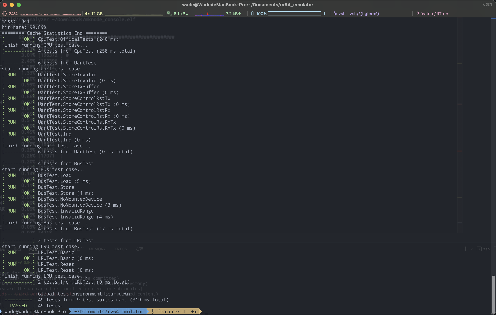

rv64_emualtor
===========

Simple RISC-V 64bit emulator, which can boot linux kernel.

The **rv64_emulator** project is a RISC-V ISA emulation suite which contains a full system emulator and an ELF instruction frequency analyzer:

* **rv64_emulator** - _full system emulator with soft MMU_
* **rv_analyzer** - _ELF file instruction frequency analyzer_

_**RISC-V full system emulator**_

The **rv64_emulator** includes a full system emulator that implements the RISC-V privileged ISA with support for interrupts, MMIO (memory mapped input output) devices, a soft MMU with TLB. It has the following features:

- riscv64ima plus privileged ISA
- Soft MMU supporting sv39 page translation modes
- Abstract MMIO device interface for device emulation
- Extensible decoder and interpreter generated from [riscv-opcodes](https://github.com/riscv/riscv-opcodes.git) ISA metadata


## Project Goals

The future goals of this project are:

- Support F, D, C and more ISA extensions
- High performance emulation, binary translation and JIT
- Virtio devic support


## Getting Started

_**Step 0: Install Dependencies**_
- Necessary Dependencies
  - xmake
  - gcc-8.1 or clang-5.0 (C++17 minimum)
- Optional Dependencies
  - Customized RISC-V GNU Toolchain (If you want to build rootfs and kernel by yourself. Step 2 for more details)
  - riscv64-unknown-elf Toolchain (If you want to build opensbi by yourself and run unittest. It can be installed by apt)
  - Device Tree Compiler (If you want to build dtb by yourself. It can be installed by apt)
  - `lcov` and `genhtml` (If you want to generate code coverage rate report. It can be installed by apt)


_**Step 1: Building rv64_emulator**_
```
$ git clone https://github.com/WadeGao/rv64_emulator.git
$ cd rv64_emulator
$ git submodule update --init --recursive --remote
$ xmake
```

After finish building rv64_emulator, if you don't want to waste time on compiling customized riscv toolchain and essential components of the bootable kernel, just download the pre-build bootable kernel from [GitHub release pages](https://github.com/WadeGao/rv64_emulator/releases) and download `fw_payload.bin` and then jump to Step 4

_**Step 2: Building riscv-gnu-toolchain**_

Assume that the customized toolchain will be installed to `/data/riscv-gnu-toolchains`
```
$ sudo apt install autoconf automake autotools-dev curl libmpc-dev libmpfr-dev libgmp-dev gawk build-essential bison flex texinfo gperf libtool patchutils bc zlib1g-dev libexpat1-dev
$ git clone https://github.com/riscv/riscv-gnu-toolchain.git
$ cd riscv-gnu-toolchain
$ git rm qemu
$ git submodule update --init --recursive --remote
$ ./configure --prefix=/data/riscv-gnu-toolchains --with-arch=rv64ima --with-abi=lp64
$ make linux
```
After the compilation finish, make sure to add the installation path of the toolchain (`/data/riscv-gnu-toolchains/bin`) into your PATH.

_**Step 3: Build the bootable kernel**_

Option dependencies should be installed. [An one-click kernel building script](scripts/build_kernel.sh) has been provided.

```bash
$ ./scripts/build_kernel.sh
```

About 15 ~ 20 minutes will be taken for this script to finish. The exact time depends on your network and the performance of your computer. 

After the compilation finishes succcessfully, the bootable kernel will be found at `./build/kernel/fw_payload.bin`

_**Step 4: Booting Linux kernel using rv64_emulator**_

If you reach here from Step 1, assuming the download path is `~/Download/fw_payload.bin`, just run the following command to boot the kernel:
```bash
$ ./build/rv64_emulator ~/Download/fw_payload.bin
```

If you reach here from Step 3 and have compiled the customized toolchain and the bootable kernel by yourself, run this command:
```bash
$ ./build/rv64_emulator ./build/kernel/fw_payload.bin
```

## Run unittest and generate code coverage report

#### Run unittest
##### 1. Build [official testcase](https://github.com/riscv-software-src/riscv-tests.git)

[one-click officical testcase building script](scripts/build_riscv_tests.sh) is also provided. Considering that the emulator supports risv64ima and privilege ISA, so we need to build the corresponding ISA extension testcase (rv64ui, rv64si, rv64mi, rv64ua, rv64um)

```bash
$ ./scripts/build_riscv_tests.sh rv64ui
$ ./scripts/build_riscv_tests.sh rv64si
$ ./scripts/build_riscv_tests.sh rv64mi
$ ./scripts/build_riscv_tests.sh rv64ua
$ ./scripts/build_riscv_tests.sh rv64um
```

After the compilation finished，the elf format testcases can be found at `test/elf`

##### 2. Build unittest and run

```bash
$ xmake
$ ./build/unittest
```

Then the unittest results will be shown on terminal.



#### Code coverage report
The code coverage rate is about 96.3%. Run the following command if report is needed:
```bash
$ xmake clean
$ xmake f -c
$ xmake f -m coverage
$ xmake
```

Then the code coverage report will be found at `build/coverage/index.html`, view it using brower.
## Screenshots

#### Running Linux kernel


#### Analyze Linux Kernel Instruction Frequency


## Project Structure

| Directory    | Description
| :----------- | :---------------
| `src/cpu`    | riscv64ima and privilege ISA
| `src/device`    | MMIO devices
| `src/libs`    | common functions and portable arithmetic
| `test`    | Unittest cases
| `tools`    | tools like rv_analyzer src 
